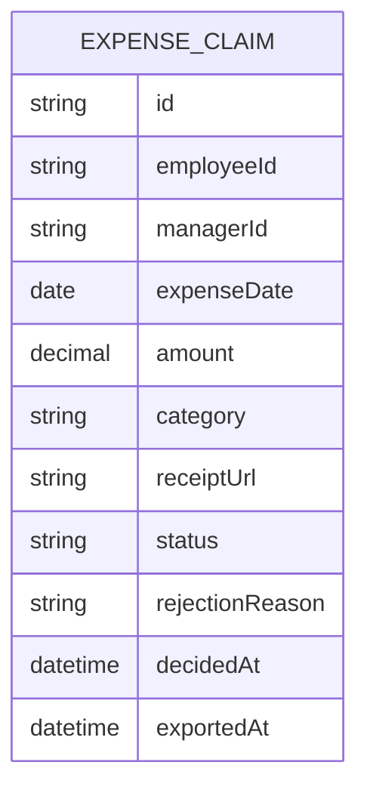

# Domain Model

The system's central entity is the expense claim, tracked from submission
through approval to payroll export.

- `employeeId` and `managerId` reference people in the organization's identity
directory (Thunder); they are not modeled as local entities.
- `status` is one of `pending`, `approved`, `rejected`.
- `receiptUrl` is empty for claims at or below the $25 receipt threshold.
- `exportedAt` is set the moment a claim is included in a payroll export and
excludes it from every future export.