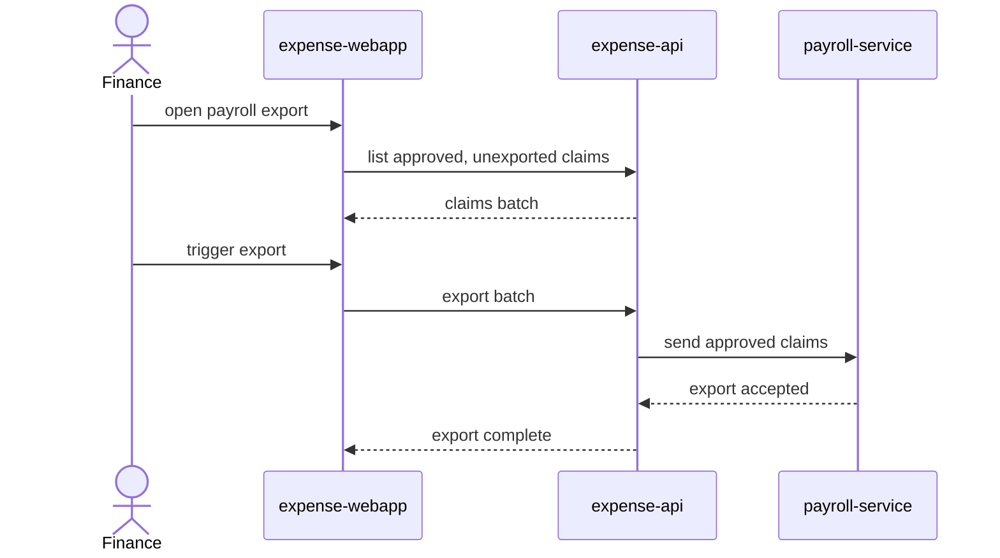

# Export approved claims to payroll

Finance reviews the approved, not-yet-exported claims and exports them to
payroll as one batch, on demand.

```mermaid
sequenceDiagram
    actor Finance
    participant expense-webapp
    participant expense-api
    participant payroll-service

    Finance->>expense-webapp: open payroll export
    expense-webapp->>expense-api: list approved, unexported claims
    expense-api-->>expense-webapp: claims batch
    Finance->>expense-webapp: trigger export
    expense-webapp->>expense-api: export batch
    expense-api->>payroll-service: send approved claims
    payroll-service-->>expense-api: export accepted
    expense-api-->>expense-webapp: export complete
```