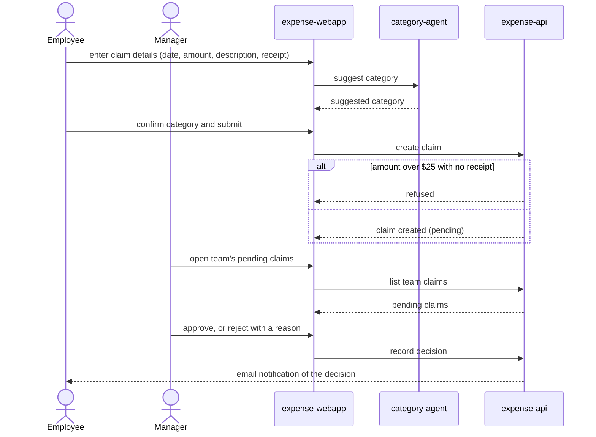

# Submit and approve an expense claim

An employee submits a claim with an agent-suggested category; their manager
reviews it and approves or rejects it, and the employee is notified of the
decision by email.

